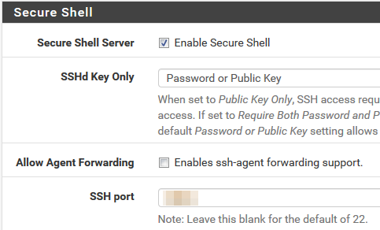
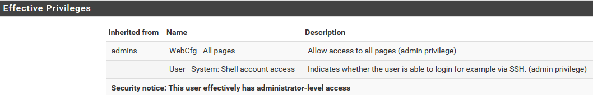
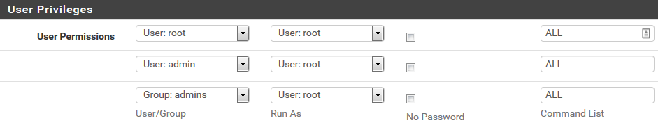
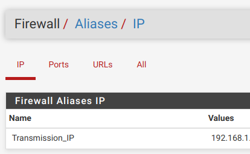
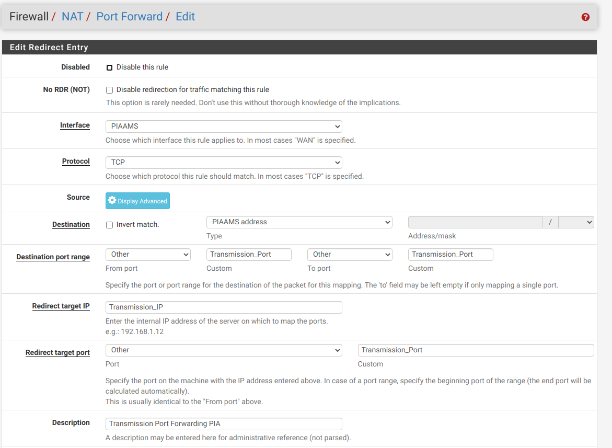
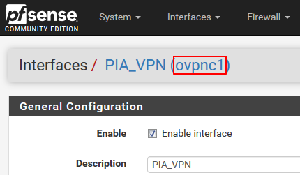
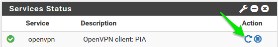
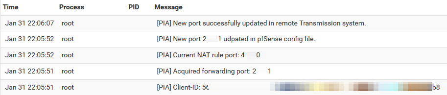
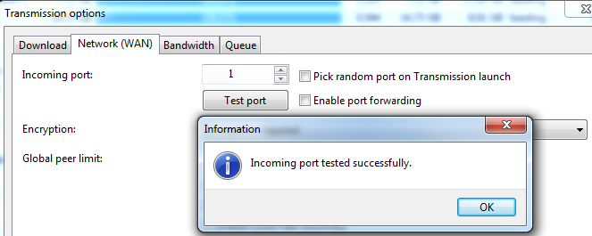

# PIA NextGen Servers Port Forwarding + Transmission support - Unofficial
New PIA pfSense (Private Internet Access) port forwarding API script for next gen servers. Tested on pfSense 2.4.5-RELEASE-p1 (amd64) and transmission-daemon 2.94. 

# **Issue introduced in 2.5.1: Regression #11805 breaks port forwarding. Please use 2.5.2.**

# **Before starting make sure to have configured PIA on your pfSense according to this guide: https://blog.networkprofile.org/private-internet-access-vpn-on-pfsense/**

For a list of nextgen servers supporting port forwarding: https://github.com/fm407/PIA-NextGen-PortForwarding/blob/master/nextgen-portforward-servers.txt 

The scripts have variables that you must change in order for the script to work, make sure to read the scripts before running them.

Your pfSense needs the following packages: `xmlstarlet` `jq` (details in step I.8.)

Now you can follow this guide:

# **I. pfSense side**

**1.Enable SSH on pfSense**</br>
System -> Advanced => tick "Enable Secure Shell"</br>


**2.Create custom user**</br>
-Go to System -> User manager -> Add</br>
-Fill Username, password</br>
-Add "admins" group</br>
-Grant "WebCfg - All pages" and "User - System: Shell account access" priviledges</br>
-(Optional) generate SSH keys for your custom user</br>
</br>

**3.Install SUDO package**</br>
-Go to System -> Package Manager => install SUDO package</br>
-Go to System -> sudo => create user permissions as bellow</br>
</br>

**4.Create Alias for port forward**</br>
-Go to Firewall -> Aliases -> Ports</br>
-Create new port with name "Transmission_Port"</br>
-Give it the current port (if you have it) or non-zero value</br>
</br>

**5.Create Alias for Transmission IP address**</br>
-Go to Firewall -> Aliases -> IP</br>
-Create new port with name "Transmission_IP"</br>
-Define IP or FQDN of your Transmisson daemon server</br>
</br>

**6.Create NAT rule for port-forward using the ALIAS instead of specific port/IP**</br>
-Go to Firewall -> NAT</br>
-Create new rule like bellow (some values could be different depending on your current VPN configuration)</br>
</br>

**7.Create custom devd config file**</br>
-SSH to the pfSense box with the user created in step 2.</br>
```
sudo su -
#<enter your user password>
#Enter an option: 8 for shell
mkdir /usr/local/etc/devd
cd /usr/local/etc/devd
vi piaport.conf
```
-paste following code and save ( :wq )- This will start the service when the PIA interface is up and stop it when down</br>

```
notify 0 {
        match "system"          "IFNET";
        match "subsystem"       "(ovpnc1)";
        match "type"            "LINK_UP";
        action "logger $subsystem is UP";
        action "service piaportforwarding start";
};

notify 0 {
        match "system"          "IFNET";
        match "subsystem"       "(ovpnc1)";
        match "type"            "LINK_DOWN";
        action "logger $subsystem is DOWN";
        action "service piaportforwarding stop";
};
```
-Restart devd to properly parse the new definition
```
service devd restart
```
**Note: The "ovpnc1" is a technical name of the OpenVPN interface from within the pfSense UI**</br>
</br>

**8.Install xmlstarlet and jq packages**</br>
-Still under root user from previous step do</br>
```
perl -pi -e 's/FreeBSD:\ \{\ enabled:\ no/FreeBSD:\ \{\ enabled:\ yes/g' /usr/local/etc/pkg/repos/FreeBSD.conf
perl -pi -e 's/FreeBSD:\ \{\ enabled:\ no/FreeBSD:\ \{\ enabled:\ yes/g' /usr/local/share/pfSense/pkg/repos/pfSense-repo.conf
pkg install xmlstarlet
```
-Answer "y" to the installation prompts
-`jq` should be already present (`which jq` returns path to binary) but in case it is missing install it by `pkg install jq`

**9.Create the custom port-update script**</br>
-Still under root user from step 7. do</br>

```
mkdir -p /home/custom/piaportforward
cd /home/custom/piaportforward
touch pia-pfSense.sh
chmod u+x pia-pfSense.sh
vi pia-pfSense.sh
```
-Paste the code from https://github.com/fm407/PIA-NextGen-PortForwarding/blob/master/pia-pfSense.sh OR just download it and chmod +x it.</br>
**!!! Some customization is necessary. Please read the script. It will need at minimum your PIA user and pass and the Transmission rpc user/pass !!!**</br>

Put https://github.com/fm407/PIA-NextGen-PortForwarding/blob/master/pia-portforwarding-rc in `/usr/local/etc/rc.d` (rename to pia-portforwarding) and chmod +x it or just:</br>

```
touch /usr/local/etc/rc.d/piaportforwarding
chmod +x /usr/local/etc/rc.d/piaportforwarding
vi /usr/local/etc/rc.d/piaportforwarding
```

And paste the following in it:</br>

```
#!/bin/sh

# REQUIRE: LOGIN

. /etc/rc.subr

name="piaportforwarding"
rcvar="${name}_enable"
command="/home/custom/piaportforward/pia-pfSense.sh"
command_interpreter="/bin/sh"
pf_user=root
start_cmd="/usr/sbin/daemon -f -u $pf_user $command"

load_rc_config $name
run_rc_command "$1"
```
Then:</br>

```
touch /etc/rc.conf.local
vi /etc/rc.conf.local
```
</br>

And paste the following: `piaportforwarding_enable="YES"`

-Disconnect form pfSense</br>
-(Optional) Disable SSH via WebUI under System -> Advanced => un-tick "Enable Secure Shell"</br>
</br>

# **II. Transmission host side**</br>
-This part is for a Debian 10 host, your mileage may vary depending on the distro you use for your Transmission host.</br>
-If there is something already configured on your side please read the steps anyway just to be sure there are no tiny difference.</br>

**1.Secure Transmission RPC Protocol**</br>
-STOP the transmission daemon by `systemctl stop transmission`</br>
-Edit /etc/transmission-daemon/settings.json</br>
-Note that the location of settings.json may vary. The above path is from Debian 10.</br>
-Update/add following parameters. Replace username, password. Ensure that IP address of your pfSense is in whitelist, you can whitelist additional IPs.</br>

```
"rpc-authentication-required": true,
"rpc-username": "SomeUserName",
"rpc-password": "SomePassword",
"rpc-whitelist": "127.0.0.1,10.10.10.1,10.10.10.5",
```

-Start the transmission service again `systemctl start transmission`</br>

**2.Restart OpenVPN in pfSense**</br>
</br>
-Wait for ~15secs and check Status -> System logs to see results</br>
</br>
-All OK, port changed</br>
</br>
